Static type-checking

Typescript có cơ chế tự check lỗi lúc runtime. Điều này giúp chúng ta có thể phát hiện lỗi trước khi code chạy.

Ví dụ dưới đây, Javascript sẽ không văng lỗi ngay lập tức nhưng Typescript sẽ phát hiện lỗi ngay.

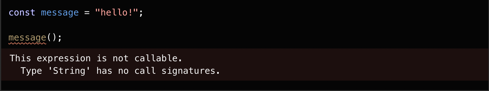

Trường hợp này, Javascript sẽ trả về undefined, Typescript sẽ báo lỗi không tồn tại thuộc tính location.

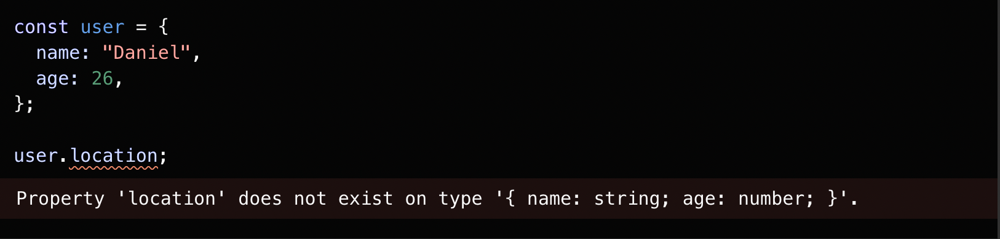

Types for Tooling

Typescript sẽ nhắc code cho bạn, nhắc những thuộc tính hay function có thể truy cập của 1 biến theo kiểu.

TypeScript compiler

```shell
#Chuyển file ts sang file js sử dụng tsc (tự động generate ra file js và thực thi câu lệnh của file đó)
tsc file_name.ts
node file_name.js
```

**Ghi chú:** Typescript sẽ phát hiện tất cả các lỗi typo, truyền thiếu params,...

Explicit Types (Kiểu tường minh)

Add thêm type cho person và date
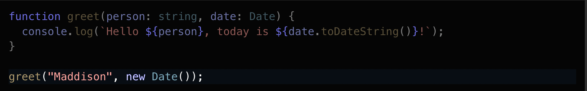

Nhiều khi chúng ta không cần phải khai báo tường minh kiểu dữ liệu cho 1 biến, mà Typescript đủ thông minh để detect ra được biến đó kiểu gì

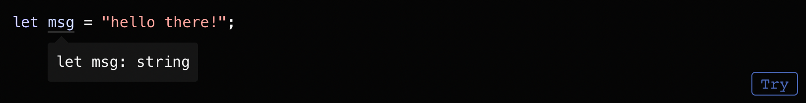

Any type

Khi bạn không biết được cụ thể kiểu dữ liệu của 1 biến thì có thể cân nhắc dùng any
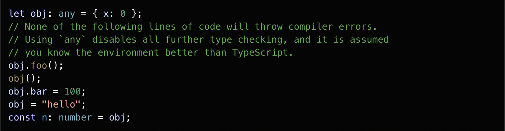

Parameter type
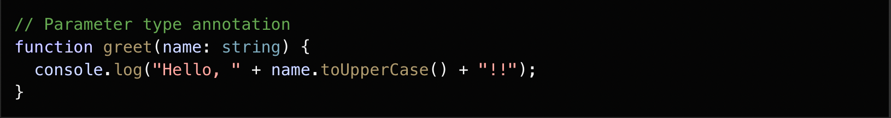

Return type


Object type
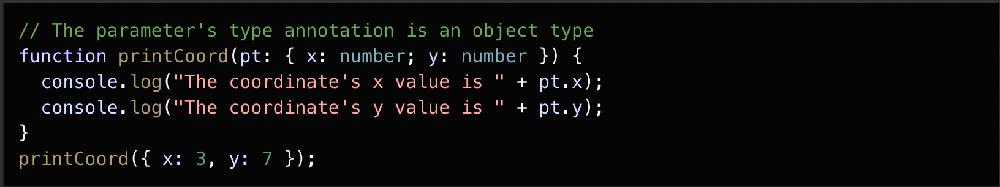

Optional parameter
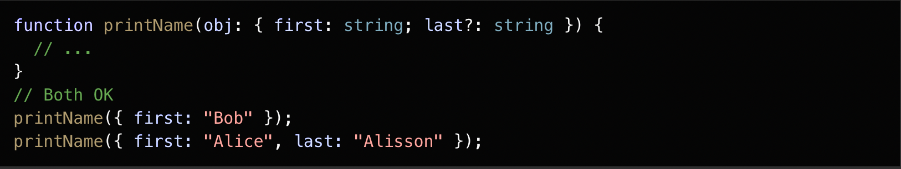

Union type
Kết hợp của 2 hoặc nhiều type để đại diện kiểu dữ liệu cho 1 biến.
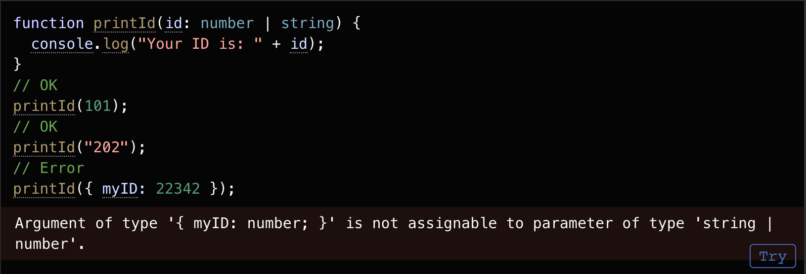
Nó chỉ cho phép thực hiện những action mà hợp lệ cho tất cả các type có trong union type. Ví dụ nếu bạn có union type kiểu `string | number` thì bạn không thể thực hiện các phương thức chỉ có trên `string`:
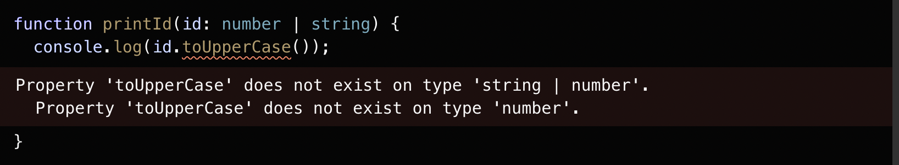
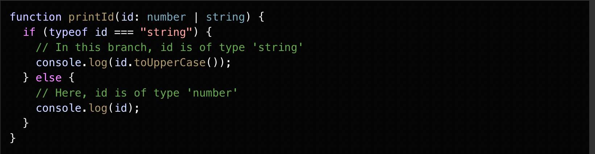

Alias Type (là tên đại diện cho bất cứ custom type nào)
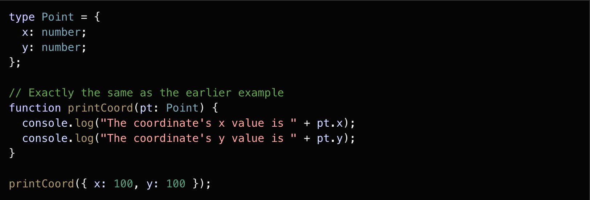

Interface (cách khác để đại diện cho bất cứ custom type nào)
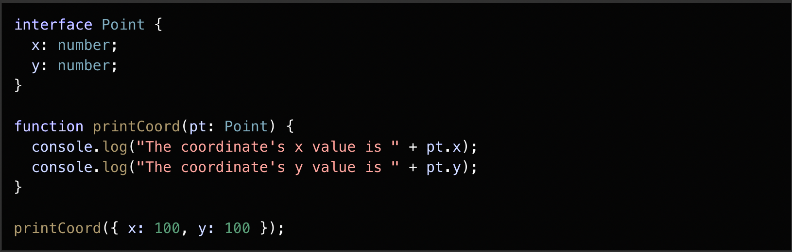

Vậy sự khác nhau nào giữa type alias và interface?
Type alias và interface khá là giống nhau và trong nhiều trường hợp bạn có thể thoải mái lựa chọn trong việc sử dụng type hay là interface. Hầu hết những gì làm được trên interface thì type cũng làm được. Cái khác nhau lớn nhất đó là type không thể re open để add thêm properties trong khi interface thì luôn có thể extend thêm bất cứ thuộc tính nào.

Cách extend giữa type và interface

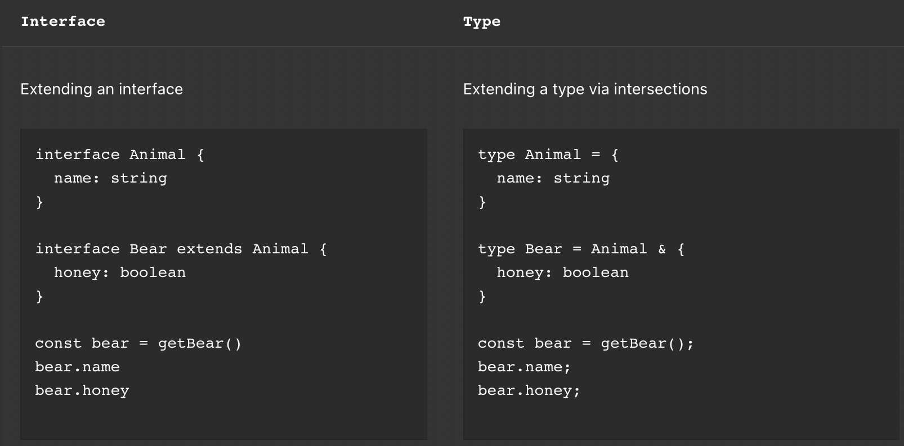

Thêm thuộc tính giữa type và interface

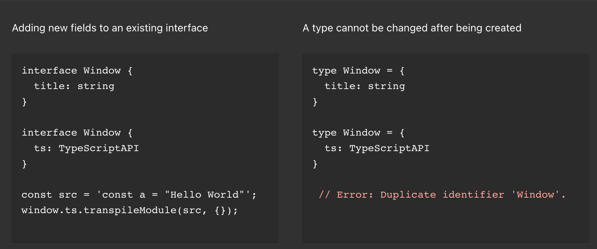

Assertion Type
Nhiều khi bạn biết được chắc chắn thông tin về kiểu dữ liệu của 1 biến cụ thể hơn là cách mà Typescript tự detect, lúc đó bạn sẽ cần đến Assertion type.

Sử dụng với cú pháp as ....

Ví dụ dưới dây Typescript nó sẽ chỉ biết là trả về 1 HTMLElement nhưng bạn sẽ biết nó cụ thể hơn là nó thuộc HTMLElement nào, ở đây là HTMLCanvasElement


Literal type
Nhiều khi bạn muốn cố định chính xác 1 biến có giá trị và kiểu dữ liệu là như nhau luôn, lúc đó hãy nghĩ đến literal type.

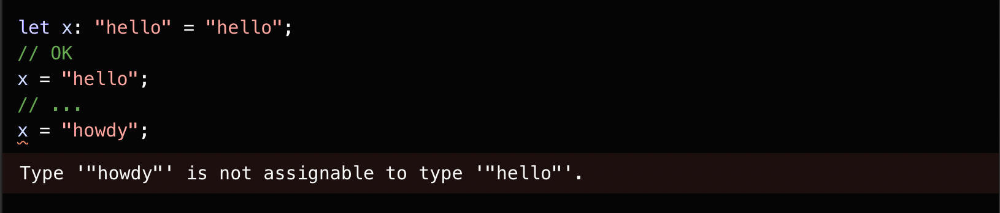

Nhưng nếu biết kết hợp giữa Union type và Literal type thì sẽ trở thành 1 sự kết hợp hoàn hảo. Ví dụ như function dưới đây chỉ chấp nhận truyền vào những giá trị biết trước.

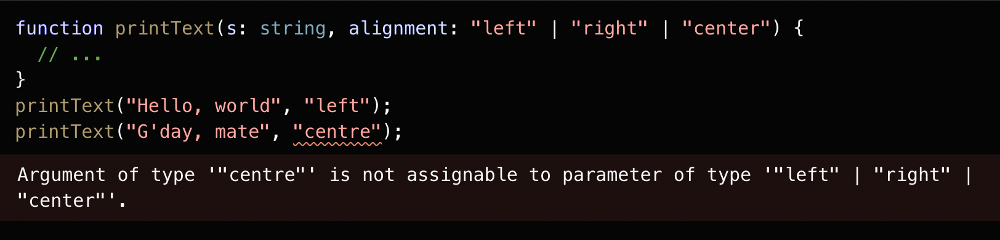

Enum type
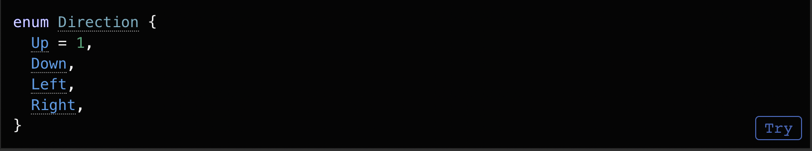

Typeof
Chúng ta có thể sử dụng typeof để check type của 1 biến, điều này khá hữu ích trong trường hợp check cho union type.

Intersection type
Typescript cho phép tạo ra 1 type mới kết hợp giữa các object type có sẵn

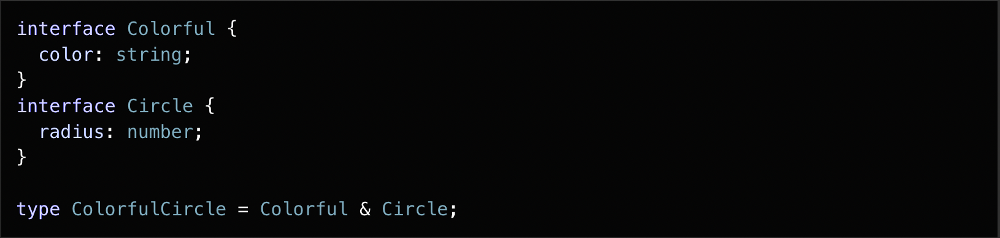

Generic Type
Khi bạn muốn tạo 1 type linh động tương ứng với giá trị truyền vào, Typescript cho phép bạn làm điều đó thông qua Generic Type thay vì xác định sẵn 1 type cố định

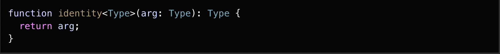


Khai báo function generic dạng arrow:
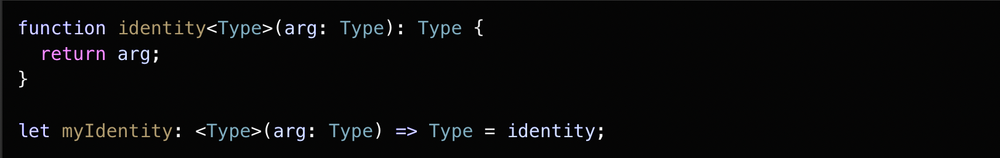

Generic class:
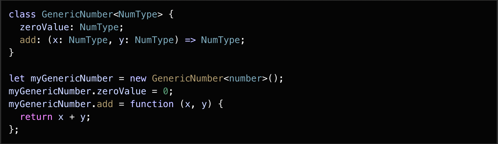

Keyof Type Operator:
Keyof nhận vào 1 object type và xử lý trả về 1 literal union type chưa key của object.
Ví dụ dưới dây P sẽ có kiểu giống như `x | y`
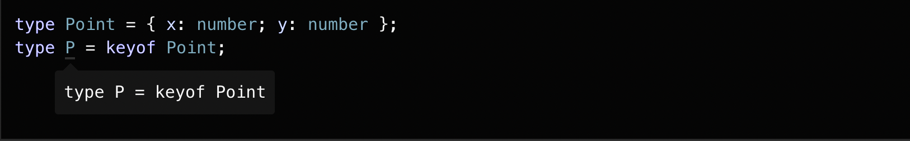

Utility Type:

Partial<Type>: biến tất cả thuộc tính của object type thành optional.
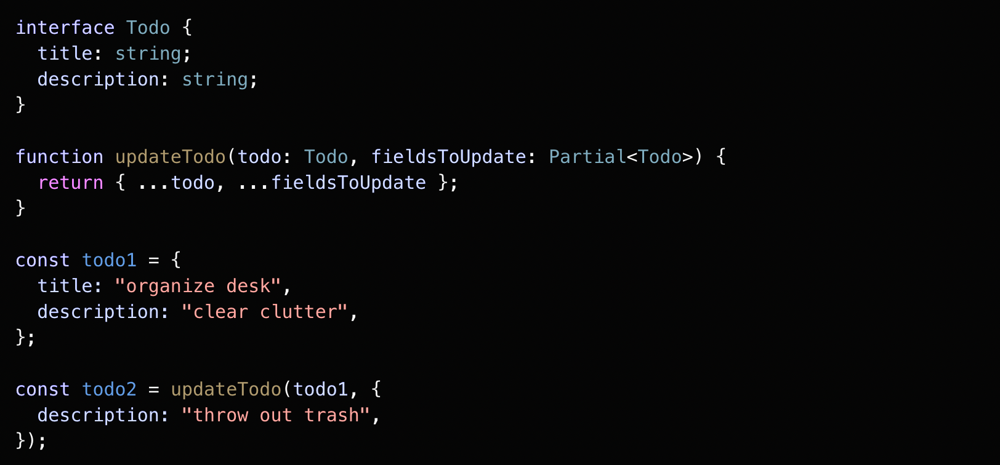

Required<Type>: biến tất cả thuộc tính của object type thành bắt buộc.
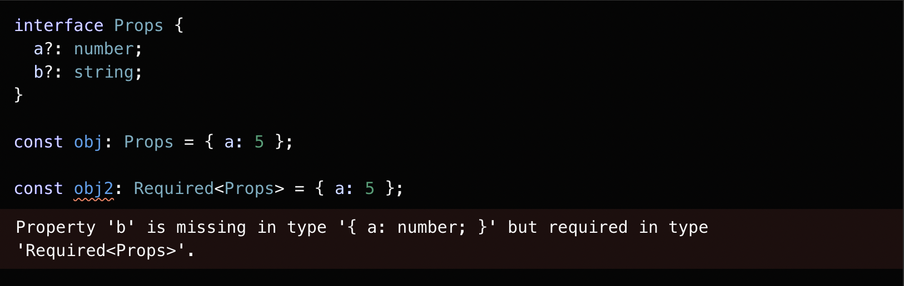

Readonly<Type>: biến tất cả thuộc tính của object type thành readonly nghĩa là không thể override giá trị, chỉ có thể read.
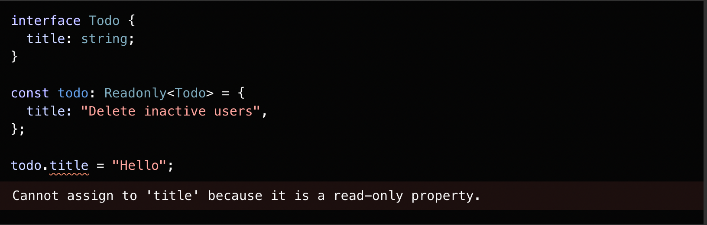

Record<Keys, Type>: dùng để map thuộc tính của object type này thành type khác.
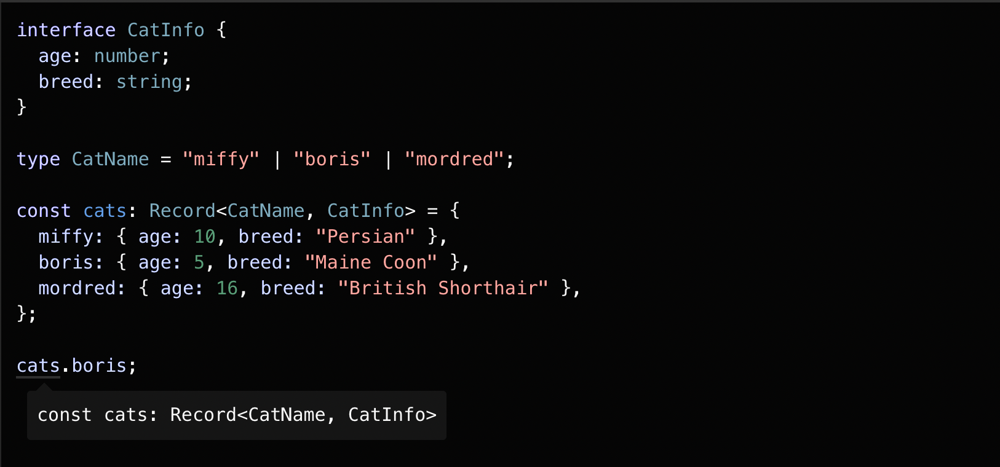

Pick<Type, Keys>: chỉ lấy những key nào thích của 1 object type.
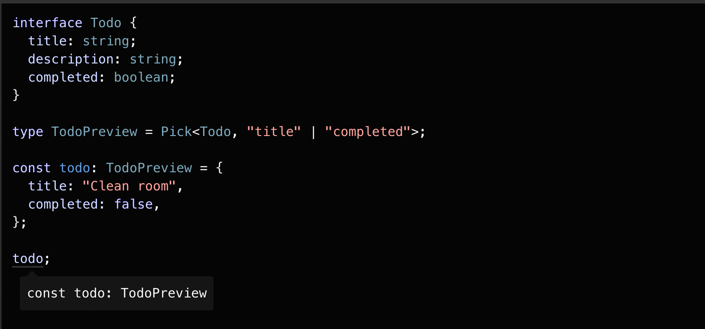

Omit<Type, Keys>: ngược lại với pick type, xóa những key nào không thích của 1 object type.
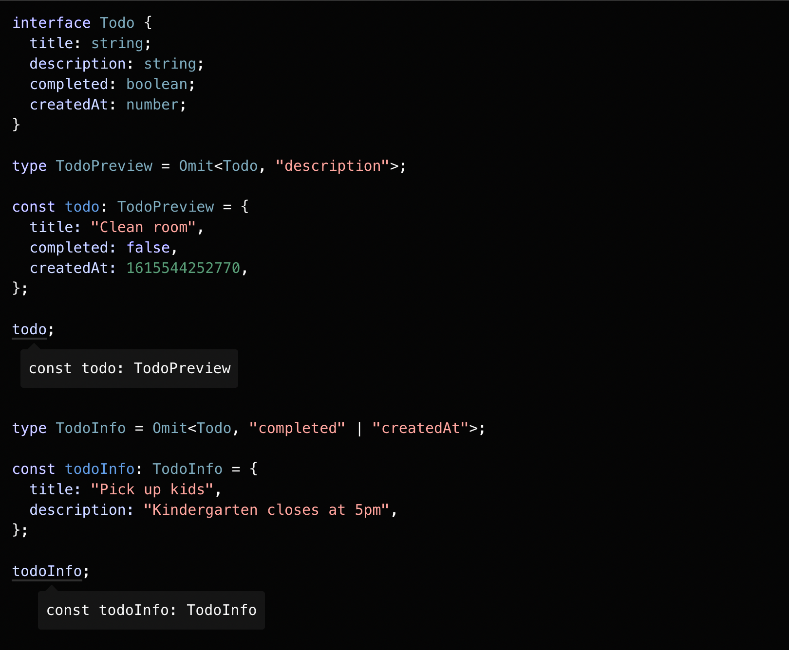

Exclude<UnionType, ExcludedMembers>: loại bỏ type từ union type
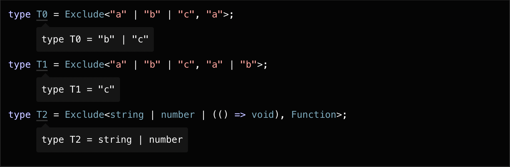

NonNullable<Type>: loại bỏ những type kiểu null hoặc undefined.
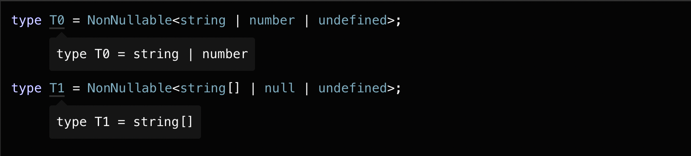
